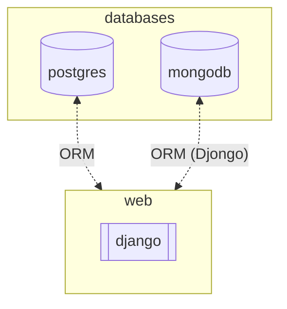
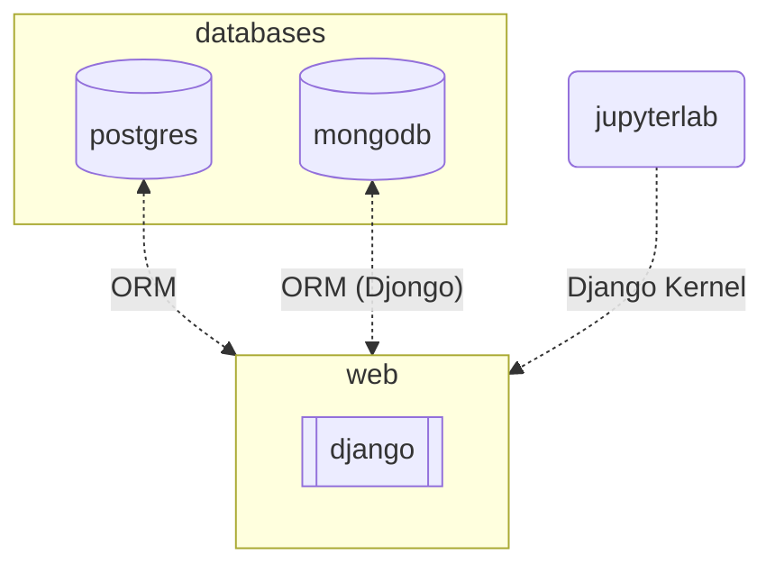

# django-multiple-db-postgresql-mongodb

A Django service with Postgres and MongoDB using Poetry for dependency management

- Why Multiple Database

different app use different database

example:

```
example_user for user data
example_app for application data
```



## Start

### Prerequisites

This project uses Poetry for dependency management. Make sure you have Poetry installed:

```shell
curl -sSL https://install.python-poetry.org | python3 -
```

### Local Development

For local development, you can use Poetry directly:

```shell
# Install dependencies
make poetry-install

# Activate Poetry shell
make poetry-shell

# Or run Django commands directly
cd django_project
poetry run python manage.py runserver --settings=myproject.multiple_db_settings
```

### Docker Development

Dockerfile 使用多階段建置（Multi-stage build）優化：

- **Builder Stage**: 安裝 Poetry 和專案依賴
- **Runtime Stage**: 只保留必要的執行環境

- build django image

```shell
make build-django-image
```

- build without cache (for clean build)

```shell
make build-django-image-no-cache
```

- clean up Docker resources

```shell
make docker-clean
```

- start with docker-compose

```shell
docker-compose up -d
```

- migrate data

```shell
make migrate-all
```

django web: 0.0.0.0:8000

## Jupterlab with Django kernel



Jupyterlab with django kernel for develop and test

```shell
make run-jupyter-with-django
```

jupyterlab: 0.0.0.0:8888


## Reference

[Djongo](https://www.djongomapper.com/get-started/)

[django-multi-db](https://docs.djangoproject.com/en/4.0/topics/db/multi-db/)

[Using Django project in Jupyter or JupyterLab](https://gist.github.com/EtsuNDmA/dd8949061783bf593706559374c8f635)

[How to use Django in Jupyter Notebook](https://medium.com/ayuth/how-to-use-django-in-jupyter-notebook-561ea2401852)

[Poetry Documentation](https://python-poetry.org/docs/)
