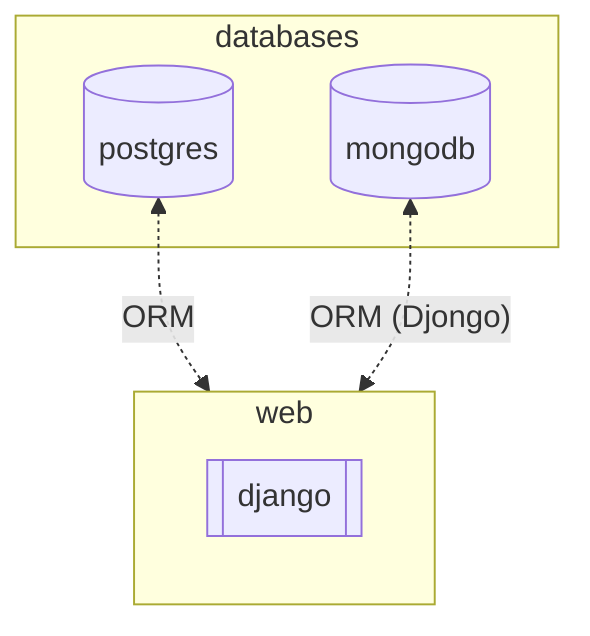
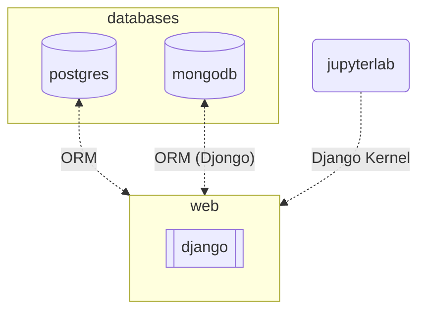

# django-multiple-db-postgresql-mongodb

A Django service that uses PostgreSQL and MongoDB in the same project, managed with `uv`.

## Why Multiple Databases

This repo demonstrates a clean separation of concerns by storing different domains in different databases:

- `example_user` app uses **PostgreSQL** for user data
- `example_app` app uses **MongoDB** for application data



## ✨ Features

- Django multi-db setup (PostgreSQL + MongoDB)
- Separate apps mapped to separate databases
- `uv`-based dependency management
- Docker multi-stage build for smaller runtime images
- Optional JupyterLab + Django kernel for rapid exploration

## 🚀 Quick Start

### Prerequisites

- `uv` installed
- Docker (optional)

Install `uv`:

```bash
curl -LsSf https://astral.sh/uv/install.sh | sh
```

### Environment Variables

Copy and adjust the sample env file:

```bash
cp .env.example .env
```

Key variables:

- `MONGO_ROOT_USER`, `MONGO_ROOT_PASSWORD`
- `MONGO_DATABASE`, `MONGO_PORT`
- `POSTGRES_NAME`, `POSTGRES_USER`, `POSTGRES_PASSWORD`
- `POSTGRES_PORT`
- `PGADMIN_DEFAULT_EMAIL`, `PGADMIN_DEFAULT_PASSWORD`

### Local Development

```bash
# Install dependencies
make uv-install

# Create a local virtual environment (optional)
make uv-venv

# Run the Django server
cd django_project
uv run python manage.py runserver --settings=myproject.multiple_db_settings
```

Django will be available at `0.0.0.0:8000`.

### Docker Development

This project uses a multi-stage Docker build:

- **Builder stage** installs `uv` and project dependencies
- **Runtime stage** includes only what is needed to run the app

```bash
# Build Django image
make build-django-image

# Clean build (no cache)
make build-django-image-no-cache

# Start services
docker-compose up -d

# Run migrations for all databases
make migrate-all

# Cleanup Docker resources
make docker-clean
```

## 🧪 JupyterLab + Django Kernel

JupyterLab can be started with a Django-aware kernel for exploration and testing:



```bash
make run-jupyter-with-django
```

JupyterLab will be available at `0.0.0.0:8888`.

## 📚 References

- [Djongo](https://www.djongomapper.com/get-started/)
- [Django multi-db docs](https://docs.djangoproject.com/en/4.0/topics/db/multi-db/)
- [Using Django project in Jupyter or JupyterLab](https://gist.github.com/EtsuNDmA/dd8949061783bf593706559374c8f635)
- [How to use Django in Jupyter Notebook](https://medium.com/ayuth/how-to-use-django-in-jupyter-notebook-561ea2401852)
- [uv Documentation](https://docs.astral.sh/uv/)
